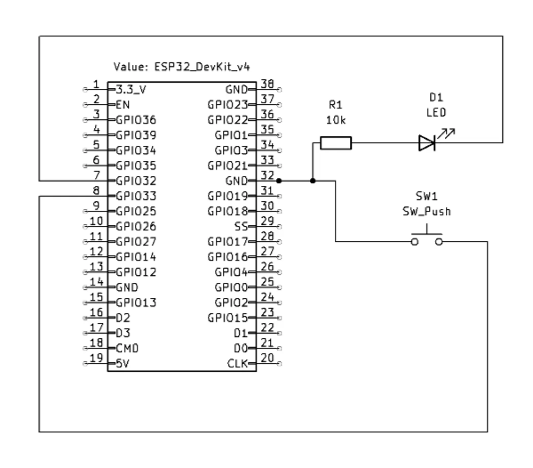

# Mesh Network LEDs

### Introduction

The requirement for the Module 5 Project was to create a working proof of concept based on our networking lab. We created a system that allowed all ESP32s to turn on and off each other’s lights.

### Setup

For this project, we had four of each of the following: ESP32, button, single LED, and 10k resistor. Cindy created the wiring diagram to the right, which shows the general layout of each ESP32. Each individual ESP had its own wiring, dependent on breadboard, resistor, and button placement.



Before we decentralized the ESP network, we started with a wireless system that had a primary and peers. The primary was essentially the host that kept track of the peers and was able to send messages to them. When the primary broadcasts a message to the peers, their respective LEDs would light up. In this code, the primary is chosen by MAC address, which results in the same primary every time.

```c
else if (peer_is_primary)
{
    Serial.println("Received a message from the primary");
    Serial.println("Light on");
    digitalWrite(LED_PIN, HIGH);
    delay(3000);
    digitalWrite(LED_PIN, LOW);
}
```

For a mesh network (or what seemed to function very closely to one), we needed to remove the role of the primary. All four ESPs are able to broadcast to the other ESPs on the same ESP-NOW channel.

When a button is pressed, it first locally toggles on or off the LED. Then, it updates **light_state**, the shared state of all LEDs, before broadcasting it to all ESPs in the network.

```c
if (last_button_state == HIGH && button_state == LOW) {
    light_state = !light_state; // Update local light state immediately
    digitalWrite(led_pin, light_state); // Reflect change on LED
    mymsg msg;
    msg.light_set = light_state;
    esp_now_send(broadcastAddr, (uint8_t*)&msg, sizeof(msg));
}
```

When a message is broadcasted into the network, all ESPs, including the sender, receive it and then update their lights accordingly.

```c
void OnDataRecv(const esp_now_recv_info* recv_info, const uint8_t* data, int len)
{
    ...
    mymsg* msg = (mymsg*)data;
    Serial.printf("[%s] Received: light_set=%d\n", macstr, msg->light_set);
    light_state = msg->light_set; // Update local light state
    digitalWrite(led_pin, light_state);
}
```

### Challenges

Throughout this process, we ran into a few hardware-related issues. 

First, we had challenges with the resistors. Some circuits used resistors with not enough resistance, such that the circuit would end up shorting, causing the respective setup to fail. This was a quick fix after diving back into the bin of resistors and finding the appropriate ones.

Next, when we were first setting up the lab, some LEDs weren’t working properly. They were either completely unusable or not bright enough; sometimes we thought that the connection wasn’t working when, in reality, the light just wasn’t clearly visible. At this point, we hadn’t swapped out all the improper resistors yet, so we tested LEDs with Cindy’s working circuit.